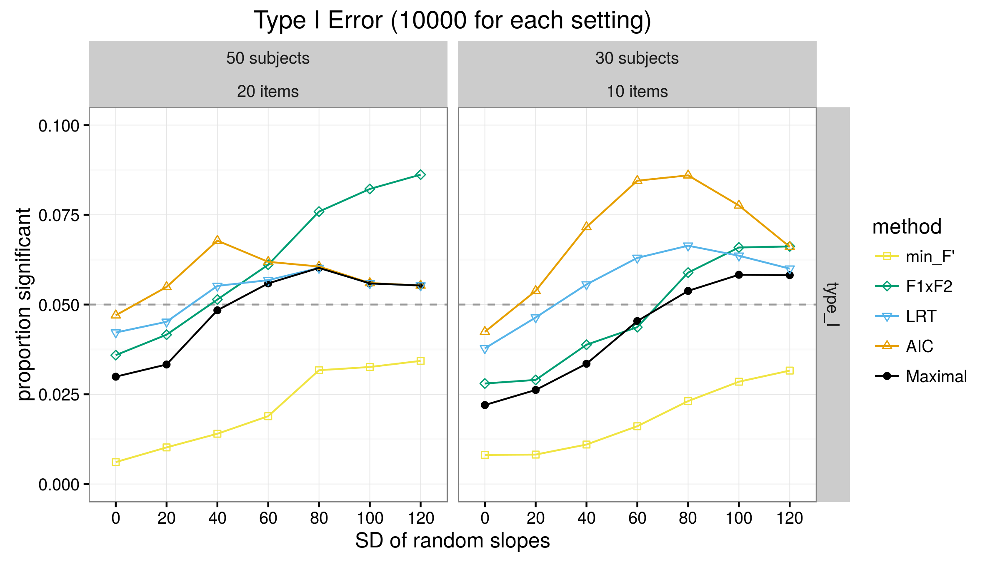
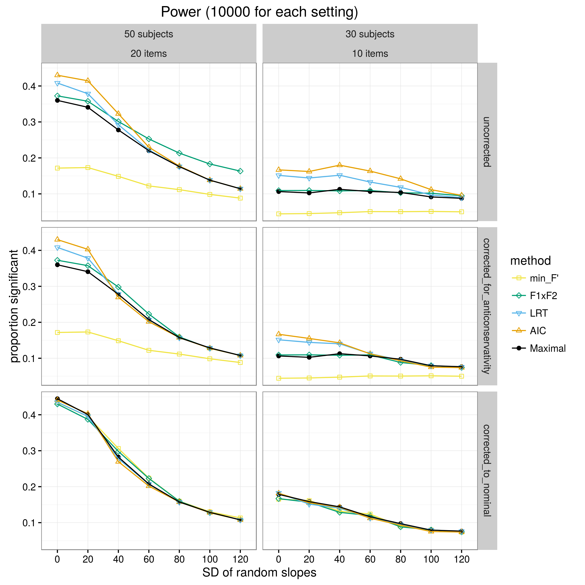

# lmmslopes: Data and R code for simulating LMM performance with varying random slopes

This repository contains code for reproducing the simulation results in Matuschek, Kliegl, Vasishth, Baayen, and Bates, ["Balancing Type I Error and Power in Linear Mixed Models"](http://arxiv.org/abs/1511.01864).

The file `replicate_matuschek/do_all.sh` contains bash code for running the simulations.

Results and figures (PDF) can be found in the subdirectory [replicate_matuschek/orig_10000](https://github.com/dalejbarr/lmmslopes/tree/master/replicate_matuschek/orig_10000).

